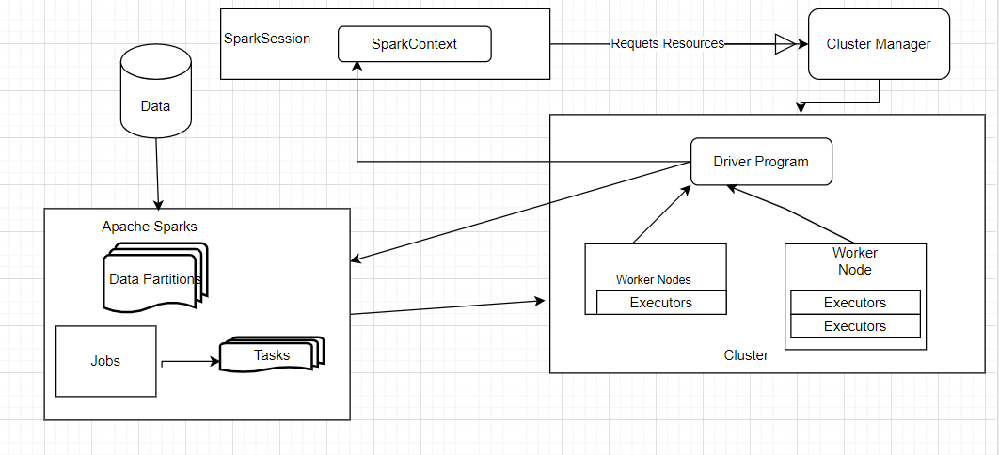
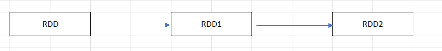
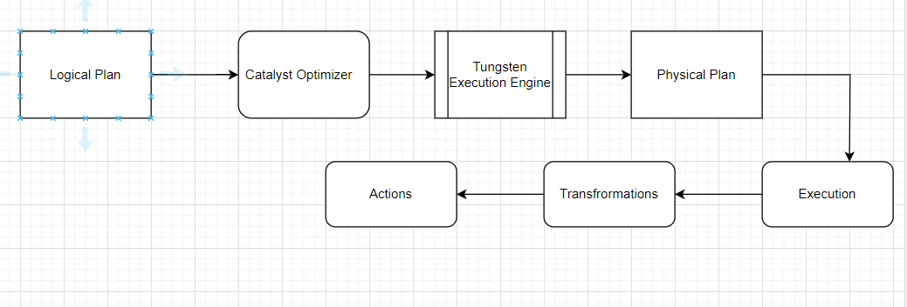

# Introduction - Apache Spark

## Contents

    - What is Apache Spark ?
    - Data structures in Apache Spark
    - How data is processed.
    - Jobs & Stages
    - Submit Application.

---

### What is Apache Spark ?

- Apache Spark is an open-source, distributed computing system designed for big data processing.
- Spark distributes data and computations across multiple nodes in a cluster. It uses a master-slave architecture, where the driver program acts as the master and cluster nodes act as workers. The driver program coordinates tasks and distributes work among the executors running on worker nodes.



### Data structures

- Data structures in Spark can be classified as follows.
  - RDD (Resilient Distributed Dataset).
  - DataFrame.
  - Datasets.

### RDD  

- **Definition**: RDD is the fundamental data structure in Spark. It is an immutable, distributed collection of objects that can be processed in parallel across a cluster.

- **Characteristics**
  - **Immutability** : Once RDD is created, it cannot be changed, you can transform an RDD to create a new RDD.
  - **Distributed** : RDDs are partitioned across the nodes of a cluster, allowing for parallel processing.
  - **Fault-tolerant** : Spark can recover RDDs from node failures using lineage information, which tracks the transformations used to create the RDD.
  - **Operations** : There are two types of operations on RDDs.
    - **Transformations** : Lazy operations that create a new RDD from an existing one (e.g., map, filter).
    - **Actions** : Operations that trigger the execution of transformations and return a result or write data to external storage (e.g., collect, saveAsTextFile).

    

    ```Python
    
        from pyspark import SparkContext

        sc = SparkContext
        data = [1, 2, 3, 4, 5]
        rdd = sc.parallelize(data)
        squared_rdd = rdd.map(lambda x: x * x)
        print(squared_rdd.collect())  # Output: [1, 4, 9, 16, 25]

            
    ```

### DataFrames

- **Definition** : DataFrame is a higher-level abstraction built on top of RDDs. It is a distributed collection of data organized into named columns, similar to a table in a relational database.

- **Characteristics**
  - **Schema** : DataFrames have schemas, which define the structure of the data (i.e., column names and data types).
  - **Optimizations** : DataFrames leverage the Catalyst optimizer for query optimization and the Tungsten execution engine for efficient execution.
  - **Ease of Use** : DataFrames provide a more user-friendly and expressive API for working with structured and semi-structured data.
  - **Interoperability** : DataFrames can be created from various data sources, including JSON, CSV, Parquet, and databases.

```Python
    from pyspark.sql import SparkSession

    spark = SparkSession.builder.appName("example").getOrCreate()

    # Create a DataFrame from a list of tuples
    data = [("Alice", 1), ("Bob", 2), ("Cathy", 3)]
    df = spark.createDataFrame(data, ["Name", "Value"])

    # Perform a transformation
    df_filtered = df.filter(df["Value"] > 1)

    # Perform an action
    df_filtered.show()
    # Output:
    # +----+-----+
    # |Name|Value|
    # +----+-----+
    # | Bob|    2|
    # |Cathy|    3|
    # +----+-----+

    # Stop the Spark session
    spark.stop()

```

### Datasets

- It is an extension to Dataframe API, the latest abstraction which tries to provide best of both RDD and Dataframe.
- Python does not have the support for the Dataset API. But due to Python’s dynamic nature, many of the benefits of the Dataset API are already available (i.e. you can access the field of a row by name naturally row.columnName)

### How data is processed in Spark?



- **Logical Plan** :
  - In this Spark determines, WHAT is to be done. It forms a high level over view of the operations it need to perform.
  - For instance, if you want to filter a dataset based on certain criteria, and then count the number of items, Spark’s logical plan would be something like “filter and then count”.
- **Catalyst Optimizer** :
  - In this stage it optimizes the logical plan for best results through rule based and cost based optimizations.
- **Tungsten Execution Engine**:
  - It represents significant advancement in performance optimization by leveraging techniques such as whole stage code generation, manual memory management and cache aware data structure.
- **Physical Plan** :
  - The physical plan represents the actual execution strategy Spark will use to carry out the computations, including the choice of operators and the sequence of operations.
- **Execution phase**
  - **Partition** : Initially spark partitions the data, but the same data can be repartitioned to increase or decrease the number of partitions based on data distribution requirements.
  - **Transformations**:
    - Transformations are basically operations that are performed on data to get the desired output, these are lazily evaluated.
    - **Narrow Dependency Transformation** : In this transformation is performed on at most 1 partition of the parent data source.
    - **Wide Dependency Transformations** : Transformations where multiple partitions of the parent data may be used to compute the partitions of the child data. These transformations involve shuffling the data across the network.
  - **Actions** :
    - Actions are operations in Apache Spark that trigger the execution of transformations and return a result to the driver program or write data to an external storage system. Unlike transformations, which are lazy and build up a lineage of operations, actions force the computation of the data flow graph and return results or save them.
  
#### Example of the flow

- **Reading Data**
  
```Python
   df = spark.read.csv("path/to/file.csv", header=True, inferSchema=True)
```

- **Partitioning**

```Python
    df = df.repartition(10)  # Increase the number of partitions to 10
    df = df.coalesce(5)      # Decrease the number of partitions to 5
```

- **Transformations**

```Python
    filtered_df = df.filter(df["age"] > 21)
    selected_df = filtered_df.select("name", "age")
```

- **Actions**

```Python
    selected_df.show()
```

### Jobs & Stages

- **Jobs** : 
  - A job in Apache Spark is the highest-level unit of computation. It represents a complete computation that Spark needs to execute to obtain a result.
  - Jobs are typically triggered by actions in Spark such as collect(), saveAsTextFile(), count(), etc. When an action is called on a DataFrame, Dataset, or RDD, Spark creates a job to compute the result.

- **Stage** :
  - A stage in Apache Spark is a set of parallel tasks that can be executed independently. Stages are determined by the boundaries where data needs to be shuffled between nodes.
  - Stages are created based on transformations in the execution plan.

```
    from pyspark.sql import SparkSession

    spark = SparkSession.builder.appName("example").getOrCreate()
    df = spark.read.csv("path/to/data.csv", header=True, inferSchema=True)

    result = df.filter(df["age"] > 21).groupBy("country").count().orderBy("count", ascending=False)
    result.show()
```

### Submitting Application in Spark.

- Submitting an application in Apache Spark is the process of deploying a Spark program to a Spark cluster to be executed.
- This step is crucial because it leverages the distributed computing capabilities of Spark to process large datasets efficiently.
- By submitting application in Apache Spark, we can achieve following.
- **Distributed Processing**:
  - **Efficiency** : Spark distributes the data and computations across a cluster of machines. This allows for parallel processing, which can handle large datasets much more quickly than a single machine.
  - **Scalability** : By submitting an application to a Spark cluster, you can scale your application horizontally. This means you can add more nodes to the cluster to handle larger datasets or more complex computations.
- **Fault Tolerance**: Incase of failure due to Directed Acyclic Graph pattern, failed node can be recomputed.
- **Resource Management**:
  - **Resource Allocation** : Submitting an application to a cluster manager (like YARN, Mesos, or Kubernetes) allows you to take advantage of resource management features. These managers allocate CPU, memory, and other resources to different tasks, optimizing resource usage and improving overall performance.
  - **Load Balancing** : Cluster managers can distribute tasks across nodes to balance the load, preventing any single node from becoming a bottleneck.
- **Centralized Management and Monitoring**:
  - **Centralized Control**: When you submit an application to a cluster, you can centrally manage and monitor it. Spark provides a Web UI for monitoring the progress and performance of your application, making it easier to identify and resolve issues.
  - **Job Scheduling**: Cluster managers can schedule and manage multiple Spark applications, allowing for more efficient use of cluster resources.
- **Integration with Big Data Ecosystem** :
  - **Data Integration**: Spark integrates seamlessly with various big data tools and storage systems like HDFS, Cassandra, HBase, and S3. Submitting your application to a Spark cluster allows it to read from and write to these systems efficiently.
  - **Unified Analytics**: Spark supports multiple analytics tasks, including batch processing, interactive querying, real-time stream processing, and machine learning. By submitting an application, you can leverage Spark’s unified analytics engine to perform complex data processing workflows.
